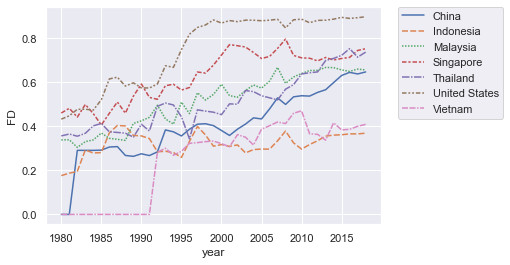
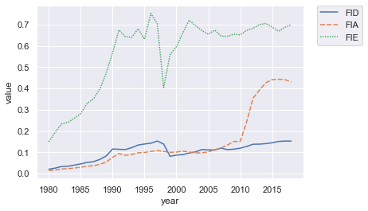
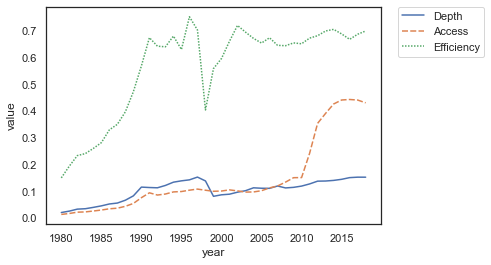

# BIES-figure67

```python
# Data source
source='https://data.imf.org/?sk=F8032E80-B36C-43B1-AC26-493C5B1CD33B'
print('Accessed 07/07/2021 from IMF website -> '+source)
```

    Accessed 07/07/2021 from IMF website -> https://data.imf.org/?sk=F8032E80-B36C-43B1-AC26-493C5B1CD33B
    


```python
# Reading the data from my github. Downloaded from
import pandas as pd

url='https://github.com/imedkrisna/BIES-figure67/raw/main/FD%20Index%20Database%20(Excel).xlsx'
df=pd.read_excel(url)
df.head()
```


<table border="1" class="dataframe">
  <thead>
    <tr style="text-align: right;">
      <th></th>
      <th>ifs</th>
      <th>code</th>
      <th>country</th>
      <th>imf_region</th>
      <th>imf_income</th>
      <th>year</th>
      <th>FD</th>
      <th>FI</th>
      <th>FM</th>
      <th>FID</th>
      <th>FIA</th>
      <th>FIE</th>
      <th>FMD</th>
      <th>FMA</th>
      <th>FME</th>
    </tr>
  </thead>
  <tbody>
    <tr>
      <th>0</th>
      <td>314</td>
      <td>ABW</td>
      <td>Aruba</td>
      <td>Western Hemisphere</td>
      <td>EM</td>
      <td>2018</td>
      <td>0.295090</td>
      <td>0.571631</td>
      <td>0.007356</td>
      <td>0.272385</td>
      <td>0.695166</td>
      <td>0.641013</td>
      <td>0.019856</td>
      <td>0.0</td>
      <td>0.0</td>
    </tr>
    <tr>
      <th>1</th>
      <td>314</td>
      <td>ABW</td>
      <td>Aruba</td>
      <td>Western Hemisphere</td>
      <td>EM</td>
      <td>2017</td>
      <td>0.297746</td>
      <td>0.577792</td>
      <td>0.006406</td>
      <td>0.272385</td>
      <td>0.709758</td>
      <td>0.641990</td>
      <td>0.017292</td>
      <td>0.0</td>
      <td>0.0</td>
    </tr>
    <tr>
      <th>2</th>
      <td>314</td>
      <td>ABW</td>
      <td>Aruba</td>
      <td>Western Hemisphere</td>
      <td>EM</td>
      <td>2016</td>
      <td>0.302239</td>
      <td>0.586555</td>
      <td>0.006459</td>
      <td>0.280556</td>
      <td>0.724822</td>
      <td>0.640035</td>
      <td>0.017434</td>
      <td>0.0</td>
      <td>0.0</td>
    </tr>
    <tr>
      <th>3</th>
      <td>314</td>
      <td>ABW</td>
      <td>Aruba</td>
      <td>Western Hemisphere</td>
      <td>EM</td>
      <td>2015</td>
      <td>0.297722</td>
      <td>0.577775</td>
      <td>0.006375</td>
      <td>0.270970</td>
      <td>0.713883</td>
      <td>0.638080</td>
      <td>0.017210</td>
      <td>0.0</td>
      <td>0.0</td>
    </tr>
    <tr>
      <th>4</th>
      <td>314</td>
      <td>ABW</td>
      <td>Aruba</td>
      <td>Western Hemisphere</td>
      <td>EM</td>
      <td>2014</td>
      <td>0.298137</td>
      <td>0.578489</td>
      <td>0.006477</td>
      <td>0.265957</td>
      <td>0.716189</td>
      <td>0.644303</td>
      <td>0.017483</td>
      <td>0.0</td>
      <td>0.0</td>
    </tr>
  </tbody>
</table>


```python
# Data for figure 6
FD=df.query('code=="IDN" or code=="USA" or code=="CHN" or code=="SGP" or code=="MYS" or code=="THA" or code=="VNM"')
```


```python
# Plotting figure 6
import matplotlib.pyplot as plt
import seaborn as sns
sns.set_theme(style="darkgrid")

# Plot the responses for different events and regions
sns.lineplot(x="year", y="FD",
             hue="country", style="country",
             data=FD)
plt.legend(bbox_to_anchor=(1.05, 1), loc=2, borderaxespad=0.)
```


    <matplotlib.legend.Legend at 0x26a1a26c3a0>


    

    


```python
# Creating dataset for figure 7
FDID=df.query('code=="IDN"')
a=FDID.melt(id_vars=['code','year'], value_vars=['FID'])
b=FDID.melt(id_vars=['code','year'], value_vars=['FIA'])
c=FDID.melt(id_vars=['code','year'], value_vars=['FIE'])
d=FDID.melt(id_vars=['code','year'], value_vars=['FMD'])
e=FDID.melt(id_vars=['code','year'], value_vars=['FMA'])
f=FDID.melt(id_vars=['code','year'], value_vars=['FME'])
FDII=pd.concat([a,b,c])
FDMM=pd.concat([d,e,f])
```


```python
# figure 7 left
sns.lineplot(x="year", y="value",
             hue="variable", style="variable",
             data=FDII)
plt.legend(bbox_to_anchor=(1.05, 1), loc=2, borderaxespad=0.)
```


    <matplotlib.legend.Legend at 0x26a1b162d30>


    

    


```python
#figure 7 right
sns.lineplot(x="year", y="value",
             hue="variable", style="variable",
             data=FDMM)
plt.legend(bbox_to_anchor=(1.05, 1), loc=2, borderaxespad=0.)
```


    <matplotlib.legend.Legend at 0x26a1afd0a90>


    

    

